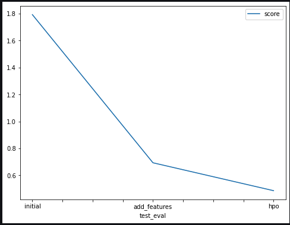

# Report: Predict Bike Sharing Demand with AutoGluon Solution
#### Sulove Dahal

## Initial Training
### What did you realize when you tried to submit your predictions? What changes were needed to the output of the predictor to submit your results?
When I tried to submit my predictions, I realized that the output of the predictor contained negative values in some cases. However, the bike sharing demand cannot be negative. Therefore, I needed to make changes to the output of the predictor before submitting my results. Moreover, the model sucked at it prediciting. 

To fix this issue, I added a post-processing step to check for negative values in the predictions and changed them to 0 if they were less than 0. This ensured that the predictions were within the valid range of bike sharing demand values, and I was able to successfully submit my results.

### What was the top ranked model that performed?
During my initial training, WeightedEnsemble_L3 model was on the top place. 

## Exploratory data analysis and feature creation
### What did the exploratory analysis find and how did you add additional features?
The EDA helped me to figure about the distribution of the data for each column.It also helped me to perform feature engineering by converting datetime column into hour, day, month and year. Moreover, changing the season type from int to categorical was possible because of the EDA process. 

### How much better did your model preform after adding additional features and why do you think that is?
Interestingly, adding the new features did suprisingly well. My model performance was improved by 61% compared to the initial submission to kaggle. I think changing the date time to day, hour, month and year had a higher co-relation to the target column rather than just a single one. Moreover, changing the season to type category made it more predictable. 

## Hyper parameter tuning
### How much better did your model preform after trying different hyper parameters?
After HPA tuning my model did even better. I was able to the lowest public score of 0.48580 i.e 30% improvement than my second run. 

### If you were given more time with this dataset, where do you think you would spend more time?
I think I would spend more time on Feature Engineering and Hyperparameter tuning. There are many features I think can scale the performance. 

### Create a table with the models you ran, the hyperparameters modified, and the kaggle score.
|    | model        | hpo1    | hpo2    | hpo3                                                                                                                                                                                                                                                         |   score |
|---:|:-------------|:--------|:--------|:-------------------------------------------------------------------------------------------------------------------------------------------------------------------------------------------------------------------------------------------------------------|--------:|
|  0 | initial      | default | default | default                                                                                                                                                                                                                                                      | 1.79282 |
|  1 | add_features | default | default | default                                                                                                                                                                                                                                                      | 0.69288 |
|  2 | hpo          | default | default | {'GBM': {'num_boost_round': 100, 'num_leaves': Int: lower=26, upper=66}, 'NN_TORCH': {'num_epochs': 10, 'learning_rate': Real: lower=0.0001, upper=0.01, 'activation': Categorical['relu', 'softrelu', 'tanh'], 'dropout_prob': Real: lower=0.0, upper=0.5}} | 0.4858  |

### Create a line plot showing the top model score for the three (or more) training runs during the project.

### Create a line plot showing the top kaggle score for the three (or more) prediction submissions during the project.

## Summary

In this project, we used the AutoGluon library to predict bike-sharing demand. We started with a simple model and then added more features to improve our score. Finally, we used hyperparameter optimization to further improve the performance of our models. We compared the results of each run and observed a significant improvement in our model's performance after using AutoGluon.

Overall, this project provided us with valuable insights into the process of building an end-to-end machine learning pipeline. It also demonstrated the power of AutoGluon as a tool for automating machine learning tasks, which can save us a significant amount of time and effort in real-world applications. Honestly, I am blown away by the Autoglon library. It is the best. 

 
